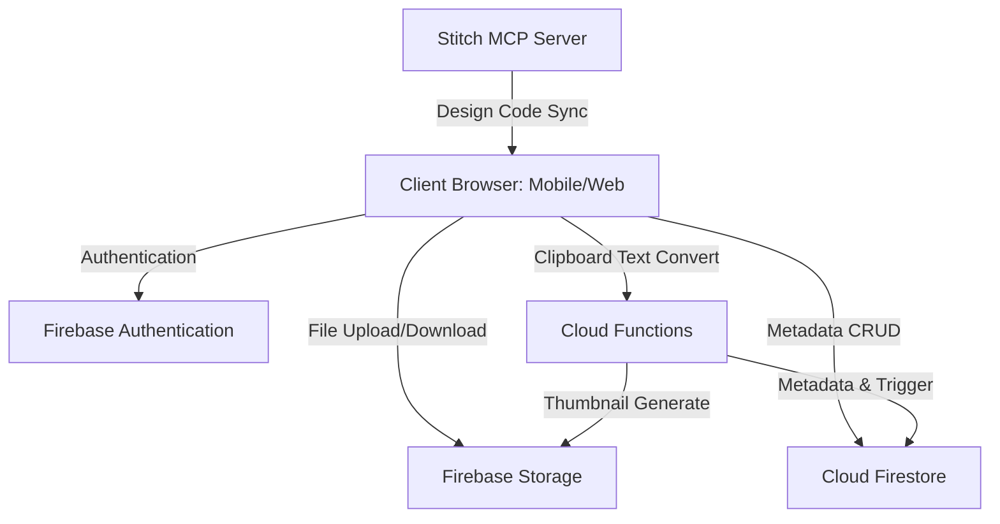

# 프로젝트 아키텍처 및 개발 계획서 (Firebase 기반 개인용 아카이브 저장소)

- **작성일**: 2026년 7월 3일
- **작성자**: PMO 책임 에이전트 릭 데커드 (Rick Deckard)
- **상태**: 의사결정 대기 (Yellow - 기획 단계 및 스펙 확정 필요)
- **프로젝트명**: 개인용 아카이브 저장소 구축 프로젝트 (Project Archive Store)

---

## 1. C-Level 보고 요약 (Executive Summary)

- **현재 상태**: **Yellow (Warning)**
  - Firebase 아키텍처 선정으로 인프라 개발 리스크는 감소하였으나, 외부 디자인 협력사(Stitch)와의 인터페이스 일정 정의 및 Firebase 비용 정책(Free Tier 초과 시 과금 구조) 승인이 지연될 경우 전체 개발 시작이 지연될 위험이 있습니다.
- **핵심 리스크 3개**:
  1. **기술적 리스크**: 클립보드 복사-붙여넣기 데이터의 무결성 처리와 모바일 뷰포트별 반응형 모달 렌더링 성능 저하 리스크.
  2. **재무적 리스크**: Firebase 대용량 파일 다운로드(Network Outbound 트래픽) 증가 시 발생하는 예상치 못한 과금 폭탄 리스크.
  3. **계약/일정 리스크**: Stitch의 디자인 시안 확정 및 Stitch MCP 기반 마크업 산출물 제공 시점이 2주차를 초과할 경우, 프론트엔드 연동 개발의 임계 경로(Critical Path)가 순연되는 일정 리스크.
- **재무 영향**: 평시 운영비는 Free Tier 범위 내에서 통제 가능(0원)하나, 파일 유출 및 Outbound 트래픽 통제 실패 시 월 최대 10만 원 이상의 OPEX 리스크 노출.
- **일정 영향**: 의사결정 지연 비용(Cost of Delay)은 매주 개발 착수 지연 시 인력 대기 비용 및 일정 순연 리스크 발생.
- **의사결정 필요 사항**: 
  - Stitch의 마크업 제공 마감일 및 Stitch MCP 서버 연동 규격 확정 승인 필요.

---

## 2. 시스템 아키텍처 분석

Firebase 서버리스 플랫폼 및 Stitch MCP(Model Context Protocol) 연동을 활용하여, 인프라 구축 및 디자인 코드 동기화 리소스를 최소화하는 방향으로 아키텍처를 설계합니다.

### 2.1. 기술 스택 세부 구성
- **프론트엔드**: React (Vite 번들러) 기반 반응형 웹앱
  - 모바일 및 웹 크로스 플랫폼 지원을 위한 뷰포트 최적화 구조 설계.
  - 디자인 및 퍼블리싱 산출물은 **Stitch MCP**를 통해 마크업(HTML/CSS) 규격을 개발팀 개발 환경에 실시간 동기화하여 이식.
- **사용자 인증 (Firebase Authentication)**:
  - 개인용 저장소이므로 간소화된 이메일/비밀번호 인증 또는 지정된 Single-User PIN 기반 로그인 적용.
- **물리 파일 저장소 (Firebase Storage)**:
  - 이미지, 텍스트(.txt), 일반 문서(.pdf, .docx 등) 업로드 파일 저장.
  - 업로드 경로 격리: `/users/{uid}/files/{file_id}_{filename}`
- **파일 메타데이터 DB (Cloud Firestore)**:
  - 파일의 상세 스펙 관리 및 실시간 필터 쿼리 지원을 위한 NoSQL DB.
  - 스키마 설계:
    - `file_id` (string, PK)
    - `filename` (string)
    - `mime_type` (string)
    - `size` (number, bytes)
    - `storage_path` (string)
    - `uploaded_at` (timestamp)
    - `tags` (array of strings)
- **서버리스 배치 (Cloud Functions - Node.js)**:
  - Storage에 이미지 업로드 트리거 작동 시, 썸네일(Thumbnail) 자동 생성 및 최적화 실행 후 메타데이터 DB 동기화.

---

## 3. 프로젝트 개발 계획 (WBS & Milestone)

전체 개발 일정을 **6주** 단위의 타이트한 마일스톤으로 설정하여 기동합니다.

### 3.1. 전체 일정 계획표 (WBS)

| 단계 | 주요 과업 (Task) | 기간 | 핵심 산출물 (Evidence) | 임계 경로 (Critical Path) |
| :--- | :--- | :--- | :--- | :---: |
| **1주차** | 요구사항 확정 및 인프라 설계 | W1 | 아키텍처 설계서, Firebase Console 환경 설정 완료 | Yes |
| **2주차** | Stitch 디자인 및 MCP 배포 | W2 | 피그마 시안, Stitch MCP 서버 연동 및 에셋 등록 | Yes |
| **3주차** | 프론트엔드 Stitch MCP 연동 개발 | W3 | UI 프레임워크 구축, MCP 연동 레이아웃 자동 동기화 | No |
| **4주차** | Firebase API 및 핵심 기능 개발 | W4 | 업로드/다운로드 API 연동, 클립보드 연동 모듈 | Yes |
| **5주차** | 통합테스트 및 보안 검증 | W5 | 통합테스트 결과 보고서, 시큐어코딩/취약점 점검표 | Yes |
| **6주차** | 안정화 및 배포 (릴리즈) | W6 | 아카이브 웹 서비스 배포, 운영자 매뉴얼 | No |

---

## 4. 핵심 관리 리스크 및 대응 시나리오

### 4.1. 기술적 리스크: 클립보드 붙여넣기 기능적 한계
- **영향**: 모바일 브라우저 환경에서는 브라우저 보안 제약으로 인해 클립보드 내 파일 직접 접근 권한(`navigator.clipboard.read`)이 차단되거나 명시적 사용자 팝업 동의가 발생하여 UX 품질이 하락할 우려가 있습니다.
- **시나리오**:
  - *Best*: 모바일 및 웹 모두 팝업 동의를 거쳐 정상 구동.
  - *Worst*: 모바일 하이브리드 웹뷰 제약으로 클립보드 읽기 불가.
  - *대응책*: 모바일 환경의 경우, 클립보드 붙여넣기가 불가능하면 파일 선택기(`input type="file"`)를 대체 수단으로 즉시 유도하는 폴백(Fallback) UI를 설계에 반영합니다.

### 4.2. 재무적 리스크: Firebase Outbound 트래픽 요금 과금
- **영향**: 개인 아카이브 저장소 특성상 대용량 이미지/동영상을 반복 다운로드 시, Firebase 스토리지의 무료 다운로드 대역폭(일 1GB 제한)을 초과하여 추가 과금이 발생합니다.
- **대응책**: Firebase Console 내에 예산 알림(Billing Alert)을 10달러 기준으로 1차 설정하고, Outbound 트래픽이 집중되는 이미지 파일은 프론트엔드 단에서 브라우저 로컬 캐싱 정책(Cache-Control)을 30일로 설정하여 불필요한 재다운로드 트래픽을 차단합니다.

---

## 5. 결론 및 의사결정 유보 시 결과 (Consequence of Inaction)

### 5.1. 의사결정 요청 사항
1. **디자인 파트너(Stitch) 계약 및 마크업 납품일 확정**: 2주차 종료일(W2 금요일)까지 퍼블리싱 산출물이 제공되지 않을 경우, 3주차 프론트 개발 공수가 붕괴되어 전체 오픈 일정이 순연됩니다.
2. **Firebase 과금 승인**: 무료 티어 초과 과금 발생 시의 결제 카드 연동 및 예산 상한선 설정 여부의 승인이 지연될 경우, W1 인프라 셋업 단계를 개시할 수 없습니다.

**경영진 결단 유보 시 결과**: 
금일 아키텍처 및 디자인 납품 일정 조율이 유보될 경우, Stitch 개발진의 리소스 배정이 지연되어 프로젝트 오픈 마일스톤이 최소 10 영업일 이상 지연될 노출(Exposure) 상태가 발생합니다.
